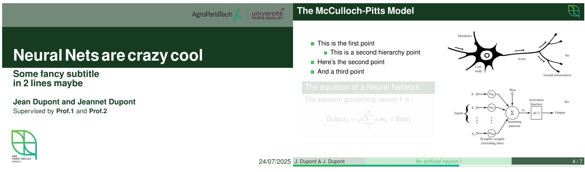

# Simple MIA

Simple MIA is a minimalist unofficial beamer theme for [MIA (Applied Mathematics and Computer Science) Unit Research](https://mia-ps.inrae.fr/en) at University Paris-Saclay. It has minimal dependencies and can be used on the fly.

This theme is based on [Lucid](https://github.com/harisont/lucid) theme.

**This repo is open for contributions !**

## Overview



## How to use this template ?

Copy `beamerthemesimpleMIA.sty` file and `assets/` directory into your project directory, then use `\usetheme{simpleMIA}`

### Institutional logos

The template is prepared to admit 4 different logos, although this feature is easily extensible. 

`\setLogo{}` Put the MIA logo in the upper right corner of the slides: 
```latex
\setLogo{assets/logo_mia_no_text.png}
```

`\setTitleLogoLeft{}` Place the main logo in the lower left corner. The logos of both teams are available in the assets, so you just need to modify the path:
```latex
\setTitleLogoLeft{assets/MIA_{ekinocs,solstis}_logo.png}
```

Finally, you can add other affiliation or partners logos in the top right corner if needed :

```latex
\setTitleExtraLogo{{path_to_logo_1}.{png,pdf}} % First optional logo.
\setTitleExtraLogoTwo{{path_to_logo_2}.{png,pdf}} % Second optional logo.

```

### Footer

The progress bar can be dissabled using `\setProgressBarOff`

## Use example

**An example can be found in the `exemple_slides.tex` file**
